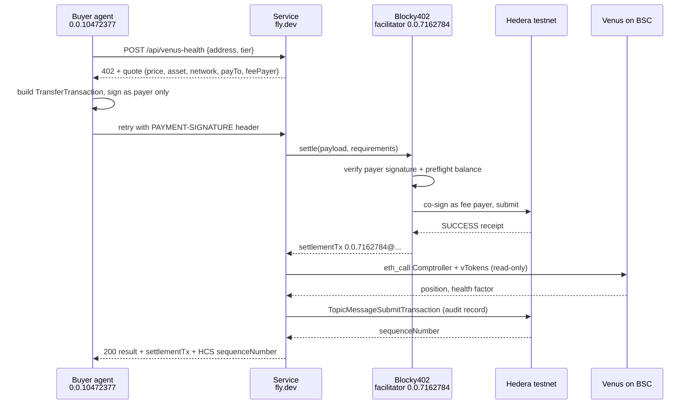

# AgenSea on Hedera: agents hiring agents, paid per call in HBAR

ETHOnline 2026, Hedera "AI & Agentic Payments" track.

AgenSea is a marketplace of on-chain agents that until now could be discovered but not
transacted with directly. This makes one of them, the Venus Health Factor Monitor
(ERC-8004 agentId 322885, already registered on BNB Smart Chain), hireable by another agent
with no human in the loop: the buyer requests work, receives an HTTP 402 quote, signs an
exact HBAR transfer, and the Blocky402 facilitator co-signs and settles it on Hedera
testnet while paying the network fee itself. Every completed sale is hashed to a Hedera
Consensus Service topic, so what was sold, to whom, for how much, and under which
settlement transaction is publicly auditable without trusting the seller.

## Verify in 3 minutes

| What | Link |
|---|---|
| Live service | https://agensea-hedera-x402.fly.dev |
| HCS audit topic (5 sales) | https://hashscan.io/testnet/topic/0.0.10472717 |
| One settlement on HashScan | https://hashscan.io/testnet/transaction/0.0.7162784@1789112920.279818410 |
| Seller account (receives HBAR) | https://hashscan.io/testnet/account/0.0.10469709 |
| Buyer agent account (pays) | https://hashscan.io/testnet/account/0.0.10472377 |
| ERC-8004 listing | https://agensea-navy.vercel.app/marketplace/2012 |

One command returns a real 402 quote from the deployed service:

```bash
curl -s -X POST https://agensea-hedera-x402.fly.dev/api/venus-health \
  -H 'content-type: application/json' \
  -d '{"address":"0x1e0395b9de1e5e4b2c52ef17b7d0c56901212c7f","tier":"summary"}' | jq
```

Three more, no signup. The last one is the raw mirror node, if you would rather not
trust an explorer or this service:

```bash
curl -s https://agensea-hedera-x402.fly.dev/health | jq   # prices, payee, agent identity
curl -s https://agensea-hedera-x402.fly.dev/audit  | jq   # the 5 sales
curl -s "https://testnet.mirrornode.hedera.com/api/v1/topics/0.0.10472717/messages?limit=10&order=desc" | jq
```

## Architecture



### Why the upfront payment flow

x402's default Hedera flow is `authorization`, which settles after the handler has already
written its response. A response can therefore never contain its own settlement id, and an
audit record written from the handler cannot reference the payment that paid for it.

The paid route declares `extra: { paymentFlow: "upfront" }`, which the Hedera exact scheme
supports. Settlement moves in front of the handler, an `onAfterSettle` hook drops the
receipt into an `AsyncLocalStorage` store, and the handler reads it. That ordering is the
only reason one response can carry the work, the settlement transaction, and the HCS
sequence number recording both. See `service/src/x402.ts` and `service/src/server.ts`.

## Prize criteria

| Requirement | How this meets it | Evidence |
|---|---|---|
| Live x402 service via Blocky402 | Express service gated by `@x402/express`, facilitator `https://api.testnet.blocky402.com`, network `hedera:testnet`, scheme `exact` | [live 402](https://agensea-hedera-x402.fly.dev/health), `service/src/x402.ts` |
| Paid request end to end | 5 real testnet settlements, buyer 0.0.10472377 to seller 0.0.10469709, all SUCCESS | [topic](https://hashscan.io/testnet/topic/0.0.10472717), table below |
| Pay-per-call metering | Two tiers priced from the request body via x402 `DynamicPrice`, one route, 0.05 vs 0.1 HBAR charged on chain | `service/src/tiers.ts`, seq 1 vs seq 2 below |
| ERC-8004 identity | agentId 322885 on BSC mainnet registry `0x8004A169FB4a3325136EB29fA0ceB6D2e539a432`; its on-chain record already declares `x402Support: true` | `service/src/identity.ts`, verify command below |
| Agent directory | Listed on the AgenSea marketplace; identity surfaced in the 402 body, `/health`, and every paid response | https://agensea-navy.vercel.app/marketplace/2012 |
| HCS audit trail | One `TopicMessageSubmitTransaction` per settled sale carrying a SHA-256 of the delivered bytes | `service/src/hcs.ts`, `GET /audit` |

### The five settlements

All confirmed SUCCESS on the mirror node. The facilitator paid the network fee on every
one, so the buyer spent exactly the quoted price and nothing else.

| Seq | Tier | Charged | Settlement |
|---|---|---|---|
| 1 | summary | 0.05 HBAR | [0.0.7162784@1789112898.381648728](https://hashscan.io/testnet/transaction/0.0.7162784@1789112898.381648728) |
| 2 | full | 0.10 HBAR | [0.0.7162784@1789112920.279818410](https://hashscan.io/testnet/transaction/0.0.7162784@1789112920.279818410) |
| 3 | summary | 0.05 HBAR | [0.0.7162784@1789112949.524610527](https://hashscan.io/testnet/transaction/0.0.7162784@1789112949.524610527) |
| 4 | summary | 0.05 HBAR | [0.0.7162784@1789113573.975682692](https://hashscan.io/testnet/transaction/0.0.7162784@1789113573.975682692) |
| 5 | summary | 0.05 HBAR | [0.0.7162784@1789154300.541416585](https://hashscan.io/testnet/transaction/0.0.7162784@1789154300.541416585) |

Verify the ERC-8004 record yourself. This returns a `data:application/json;base64,` URI
whose payload reads `"name": "Venus Health Factor Monitor"`, `"x402Support": true`:

```bash
cast call 0x8004A169FB4a3325136EB29fA0ceB6D2e539a432 "tokenURI(uint256)(string)" 322885 \
  --rpc-url https://bsc-dataseed.binance.org
```

## Payment flow details

**The 402 body.** x402 v2 puts the `PaymentRequired` document in a base64
`PAYMENT-REQUIRED` header and leaves the body empty, which is unreadable during a demo.
The service also inlines the decoded document, a plain-language quote, the tier table, the
agent identity, and the audit topic. Clients still read the header, which takes precedence,
so this is additive only.

```json
{ "quote": { "tier": "summary", "price": "0.05 HBAR", "amountTinybars": "5000000",
             "asset": "HBAR (native, asset id 0.0.0)", "network": "hedera:testnet",
             "payTo": "0.0.10469709", "scheme": "exact", "paymentFlow": "upfront" },
  "paymentRequired": { "x402Version": 2, "accepts": [
    { "scheme": "exact", "network": "hedera:testnet", "amount": "5000000",
      "asset": "0.0.0", "payTo": "0.0.10469709", "maxTimeoutSeconds": 300,
      "extra": { "paymentFlow": "upfront", "feePayer": "0.0.7162784" } }]}}
```

**Partial signatures.** The buyer builds a `TransferTransaction` debiting itself and
crediting `payTo`, sets the transaction id against the facilitator's account, freezes, and
signs as payer only. It is not yet valid. The facilitator verifies that signature against
the account's on-chain key, preflights the balance, signs as fee payer, and submits. The
buyer commits to an exact transfer and never pays gas; the facilitator can only submit the
transfer the buyer already signed.

**feePayer and network string come from the facilitator.**
`GET https://api.testnet.blocky402.com/supported` advertises
`{"scheme":"exact","network":"hedera:testnet","extra":{"feePayer":"0.0.7162784"}}`. The
scheme merges that into `paymentRequirements.extra`, so the quote always names the CAIP-2
network and the account that will pay the fee.

**Spend controls.** x402's client-side controls only auto-allow assets it recognises as
defaults, which on Hedera means USDC, so native HBAR must be opted into explicitly. The
buyer opts it in by asset id behind a per-call ceiling (`MAX_SPEND_HBAR`, default 1 HBAR):
a service quoting above budget is refused before anything is signed. Disabling spend
controls would have been one line shorter and materially worse.

## Run it yourself

Requires Node 20+ and a funded Hedera testnet account.

```bash
cd hedera
npm install
```

`hedera/.env` (git-ignored) needs these names, no values shown:
`HEDERA_NETWORK`, `SERVICE_ACCOUNT_ID`, `SERVICE_PRIVATE_KEY`, `SERVICE_KEY_TYPE`,
`FACILITATOR_URL`, `PRICE_HBAR`, `PORT`.

Written automatically, never by hand: `HCS_TOPIC_ID` on first service start, and
`BUYER_ACCOUNT_ID` / `BUYER_PRIVATE_KEY` / `BUYER_KEY_TYPE` on the first `npm run buy`,
which creates the buyer account and funds it with 50 HBAR from the service account.

Optional: `SERVICE_URL`, `MAX_SPEND_HBAR`, `BSC_RPC_URL`, `HOST`, `PUBLIC_URL`, and
`AGENT_ERC8004_*` / `AGENT_LISTING_URL` to point at a different registration.

```bash
npm run dev                                                        # service on :4021
npm run buy -- 0x1e0395b9de1e5e4b2c52ef17b7d0c56901212c7f summary  # 0.05 HBAR
npm run buy -- 0x1e0395b9de1e5e4b2c52ef17b7d0c56901212c7f full     # 0.10 HBAR

# or buy from the deployed service rather than a local one
SERVICE_URL=https://agensea-hedera-x402.fly.dev npm run buy -- 0x1e03...2c7f summary
```

The tier is positional because `npm run` hops through two npm invocations and npm eats an
unrecognised `--tier` first. Calling the workspace directly, `--tier summary` works.
Free endpoints: `GET /` (landing page), `GET /health`, `GET /audit`.

## Deploy

| File | Contents |
|---|---|
| `Dockerfile` | Two stages on `node:20-slim`. Build compiles the `service` workspace; runtime installs production deps for that workspace only and runs `node service/dist/server.js` as the unprivileged `node` user. |
| `.dockerignore` | Excludes `.env*`, `agent/` source, `node_modules`. `agent/package.json` is the one exception: npm needs every workspace manifest to validate the lockfile. |
| `fly.toml` | App `agensea-hedera-x402`, region `ams`, one `shared-cpu-1x` with 1 GB, `internal_port` 4021, HTTPS forced, `/health` check. `auto_stop_machines = "off"` and `min_machines_running = 1` so a judge never hits a cold start. |

```bash
cd hedera
fly launch --no-deploy --copy-config --name agensea-hedera-x402 --region ams --yes
fly secrets import --app agensea-hedera-x402 < .env.fly
fly deploy --app agensea-hedera-x402 --config fly.toml
```

`.env.fly` is git-ignored and holds only server-side variables filtered from `.env`. It
excludes every `BUYER_*` variable, because the buyer's key must never leave the operator's
machine, and `PORT`, which comes from `fly.toml`. `HCS_TOPIC_ID` is included so the deploy
reuses the existing audit topic instead of starting a second trail.

**IP allocation.** Fly gives the app a dedicated IPv6 and a shared IPv4. Both resolve and
serve: `A 66.241.125.254`, `AAAA 2a09:8280:1::18a:9cad:0`. The shared IPv4 routes by TLS
SNI, which is fine here. `fly ips allocate-v4` would buy a dedicated one if a judge's
network could not do SNI.

## Repo layout

```
hedera/service/src/
  server.ts           routes, 402 enrichment, tier dispatch, audit write
  x402.ts             facilitator client, Hedera exact scheme, onAfterSettle hook
  hcs.ts              topic creation, audit submit, mirror-node read
  identity.ts         ERC-8004 registration for agentId 322885
  tiers.ts            price table and tier parsing
  request-context.ts  AsyncLocalStorage carrying the settlement to the handler
  venus-health.ts     business logic, summary/full shaping, MOCK fallback
  page.ts             landing page
  venus/              vendored from apps/agents/src/venus (read-only eth_call)
hedera/agent/src/
  buy.ts              buyer CLI
  buyer-account.ts    creates and funds the buyer account on first run
hedera/               Dockerfile, fly.toml, .dockerignore
```

## Limitations

- **Testnet only.** Hedera testnet and the Blocky402 testnet facilitator. Nothing here has
  handled real value.
- **One service account.** `0.0.10469709` is seller, HCS topic admin, and submit key. A
  production deployment would separate the payee from the audit signer.
- **The HCS write is best-effort.** `submitAudit` races consensus against a 3 second
  timeout. It lands well inside that in practice, but on a slow consensus the response
  returns without the sequence number and the submit finishes in the background. A failed
  write degrades to an `audit.error` field rather than failing a request the buyer already
  paid for, so a sale can in principle settle without a matching audit record.
- **The Venus read is BSC mainnet over a public RPC.** Read-only `eth_call`, no key, no
  transaction. A public RPC can rate-limit or lag; on failure the service returns
  deterministic sample data explicitly labelled `"source": "MOCK"` rather than failing a
  paid request. All five recorded sales returned `"source": "REAL"`.
- **HashScan deep links render client-side.** They return HTTP 404 to `curl` because the
  explorer serves its app shell for every path. They work in a browser. The mirror node
  REST API returns the same records as JSON if you would rather not trust an explorer.

## Built with

[x402](https://github.com/x402-foundation/x402) v2.25.0, `@hiero-ledger/sdk` 2.85.0,
[Blocky402](https://blocky402.com), following
[hedera-dev/x402-inference-pay-per-request-poc](https://github.com/hedera-dev/x402-inference-pay-per-request-poc).
